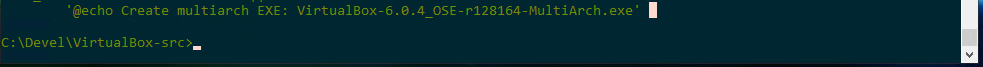
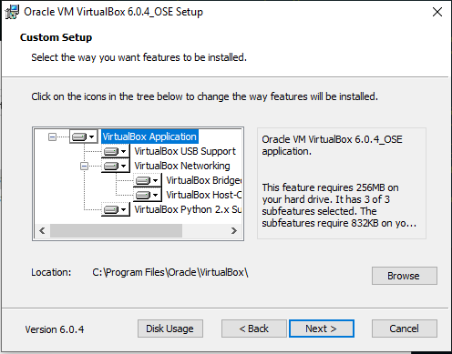
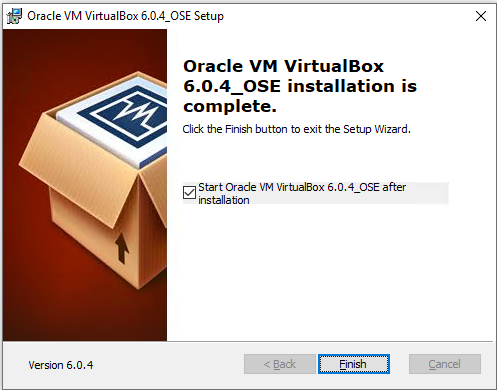
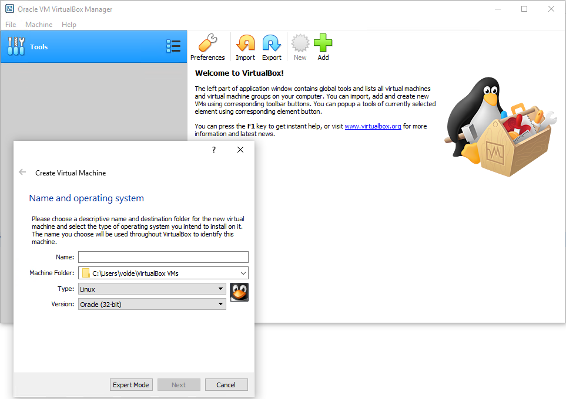

# Compiling Virtualbox on Windows

## Attempt #2 Log

Entire process was copied from [CaptainFlint's blog post](https://habr.com/en/post/447300/)

The following is just a log of what I was able to get completed.

----

### April 26, 2019

__Note: First the dev environment must be created. For my sanity and resetting/reproducing results I used a Hyper-V virtual machine.__

### Create Dev Environment:

  * Install Windows 10 on Hyper-V (Using Oct 2018 Update 1809) Create ISO (?) [Link](https://www.microsoft.com/en-us/software-download/windows10)
    * How to enable [Hyper-V](https://docs.microsoft.com/en-us/virtualization/hyper-v-on-windows/quick-start/enable-hyper-v)
    * Do all available updates for Windows. In updates options, turn on updates for other MS products.
  * Install Visual Studio 2010 Premium (Trial) (Web Installer). [Link](https://my.visualstudio.com/Downloads?q=visual%20studio%202010&wt.mc_id=o~msft~vscom~older-downloads)
    * This requires free(?) subscription to Microsoft Dev Essentials. [Link](https://visualstudio.microsoft.com/dev-essentials/)
    * Do all available updates for Windows again. Ensure Service Pack 1 for Visual Studio 2019 gets install.
      * There were 8 updates when I did this.
    * Then update again.
    * Uninstall all "Microsoft Visual C++ <*>" from Windows.
  * Install Windows SDK v7.1 [Link](https://www.microsoft.com/en-us/download/details.aspx?id=8279)
  * Install Windows Driver Development Kit (WDK) v7.1 [Link](https://www.microsoft.com/en-us/download/details.aspx?displaylang=en&id=11800)
  * Install Visual C++ 2010 SP1 Compiler Update for SDK v7.1 [Link](https://www.microsoft.com/en-us/download/details.aspx?id=4422)
    * Check for Windows updates again.
  * Install Windows SDK v8.1 [Link](https://dev.windows.com/downloads/windows-8-1-sdk)
    * Installed to C:\Programs\DevKits\8.1\
  * Install ActivePerl [Link](https://www.activestate.com/products/activeperl/downloads/)
    * Install to directory `C:\Programs\Perl\`
  * Install ActivePython [Link](https://www.activestate.com/products/activepython/downloads/)
    * Install to directory `C:\Programs\Python\`
  * Install Windows Driver Development Kit v7.1 [Link](https://www.microsoft.com/en-us/download/details.aspx?displaylang=en&id=11800)
    * Will require auto installation of more .NET frameworks.

Shut down and saved Hyper-V checkpoint.

----

### April 27, 2019

__Attempt to finish dev environment.__

  * Install WiX 311 [Link](http://wixtoolset.org/)
    * Install binaries version to `C:\Programs\WiX`
  * Install cygwin [Link](https://cygwin.com/install.html)
    * Install x64 to `C:\Programs\cygwin64`
    * Add the packages `make` and `yasm`
  * Download and extract Qt 5.6.3 source [Link](http://download.qt.io/official_releases/qt/5.6/5.6.3/single/qt-everywhere-opensource-src-5.6.3.zip)
    * Extract to `C:\Programs\Qt`
    * Rename folder extracted to `5.6.3-src`.
    * Create folder `build-x32` and `build-x64` next to it.
    * Run the following commands from a cmd prompt:
      ``` powershell
      cd /d C:\Programs\Qt\build-x32
      SET QTVER=5.6.3
      "C:\Program Files\Microsoft SDKs\Windows\v7.1\Bin\SetEnv.Cmd" /Release /x86 /win7
      COLOR 07
      SET QTDIR=C:\Programs\Qt\%QTVER%-x32
      SET PATH=%QTDIR%\bin;%PATH%
      SET QMAKESPEC=win32-msvc2010
      ..\5.6.3-src\configure.bat -prefix c:\Programs\Qt\5.6.3-x32 -mp -opensource -confirm-license -nomake tests -nomake examples -no-compile-examples -release -shared -pch -no-ltcg -accessibility -no-sql-sqlite -opengl desktop -no-openvg -no-nis -no-iconv -no-evdev -no-mtdev -no-inotify -no-eventfd -largefile -no-system-proxies -qt-zlib -qt-pcre -no-icu -qt-libpng -qt-libjpeg -qt-freetype -no-fontconfig -qt-harfbuzz -no-angle -incredibuild-xge -no-plugin-manifests -qmake -qreal double -rtti -strip -no-ssl -no-openssl -no-libproxy -no-dbus -no-audio-backend -no-wmf-backend -no-qml-debug -no-direct2d -directwrite -no-style-fusion -native-gestures -skip qt3d -skip qtactiveqt -skip qtandroidextras -skip qtcanvas3d -skip qtconnectivity -skip qtdeclarative -skip qtdoc -skip qtenginio -skip qtgraphicaleffects -skip qtlocation -skip qtmacextras -skip qtmultimedia -skip qtquickcontrols -skip qtquickcontrols2 -skip qtscript -skip qtsensors -skip qtserialbus -skip qtserialport -skip qtwayland -skip qtwebchannel -skip qtwebengine -skip qtwebsockets -skip qtwebview -skip qtx11extras -skip qtxmlpatterns
      ```
    * Edit file `C:\Programs\Qt\build-x32\qtbase\src\corelib\global\qconfig.cpp`

      Change the following line:
      ``` cpp
      static const char qt_configure_prefix_path_str       [512 + 12] = "qt_prfxpath=c:/Programs/Qt/5.6.3-x32";
      ```
      To:
      ``` cpp
      static const char qt_configure_prefix_path_str       [512 + 12] = "qt_prfxpath=.";
      ```
    * Run `nmake`
    * Run `nmake install`
    * Next we do the same for x64
    * Open a new command prompt
      ``` powershell
      md C:\Programs\Qt\build-x64
      cd /d C:\Programs\Qt\build-x64
      SET QTVER=5.6.3
      "C:\Program Files\Microsoft SDKs\Windows\v7.1\Bin\SetEnv.Cmd" /Release /x64 /win7
      COLOR 07
      SET QTDIR=C:\Programs\Qt\%QTVER%-x64
      SET PATH=%QTDIR%\bin;%PATH%
      SET QMAKESPEC=win32-msvc2010
      ..\5.6.3-src\configure.bat -prefix c:\Programs\Qt\5.6.3-x64 -mp -opensource -confirm-license -nomake tests -nomake examples -no-compile-examples -release -shared -pch -no-ltcg -accessibility -no-sql-sqlite -opengl desktop -no-openvg -no-nis -no-iconv -no-evdev -no-mtdev -no-inotify -no-eventfd -largefile -no-system-proxies -qt-zlib -qt-pcre -no-icu -qt-libpng -qt-libjpeg -qt-freetype -no-fontconfig -qt-harfbuzz -no-angle -incredibuild-xge -no-plugin-manifests -qmake -qreal double -rtti -strip -no-ssl -no-openssl -no-libproxy -no-dbus -no-audio-backend -no-wmf-backend -no-qml-debug -no-direct2d -directwrite -no-style-fusion -native-gestures -skip qt3d -skip qtactiveqt -skip qtandroidextras -skip qtcanvas3d -skip qtconnectivity -skip qtdeclarative -skip qtdoc -skip qtenginio -skip qtgraphicaleffects -skip qtlocation -skip qtmacextras -skip qtmultimedia -skip qtquickcontrols -skip qtquickcontrols2 -skip qtscript -skip qtsensors -skip qtserialbus -skip qtserialport -skip qtwayland -skip qtwebchannel -skip qtwebengine -skip qtwebsockets -skip qtwebview -skip qtx11extras -skip qtxmlpatterns
      ```
    * Edit file `C:\Programs\Qt\build-x64\qtbase\src\corelib\global\qconfig.cpp`

      Change the following line:
      ``` cpp
      static const char qt_configure_prefix_path_str       [512 + 12] = "qt_prfxpath=c:/Programs/Qt/5.6.3-x64";
      ```
      To:
      ``` cpp
      static const char qt_configure_prefix_path_str       [512 + 12] = "qt_prfxpath=.";
      ```
    * Run `nmake`
    * Run `nmake install`
    * Safe to delete src and build directories.
  * Download and extract 32 and 64 bit MinGW archives.
    * [32bit](https://sourceforge.net/projects/mingw-w64/files/Toolchains%20targetting%20Win32/Personal%20Builds/rubenvb/gcc-4.5-release/i686-w64-mingw32-gcc-4.5.4-release-win32_rubenvb.7z/download) to `C:\Programs\mingw32`
    * [64bit](https://sourceforge.net/projects/mingw-w64/files/Toolchains%20targetting%20Win64/Personal%20Builds/rubenvb/gcc-4.5-release/x86_64-w64-mingw32-gcc-4.5.4-release-win64_rubenvb.7z/download) to `C:\Programs\mingw64`
  * Download and extract NASM [Link](https://www.nasm.us/)
    * Extract to `C:\Programs\` rename directory to `nasm`
  * Download and extract OpenSSL [Link](https://www.openssl.org/source/)
    * Extract twice into `C:\Programs\OpenSSL\openssl-1.1.1b-x32` and `openssl-1.1.1b-x64`.
    * Run to make the 32bit version:
      ``` powershell
      "C:\Program Files\Microsoft SDKs\Windows\v7.1\Bin\SetEnv.Cmd" /Release /x86 /win7
      COLOR 07
      set PATH=%PATH%;C:\Programs\nasm
      cd /d C:\Programs\OpenSSL\openssl-1.1.1b-x32\
      perl Configure VC-WIN32 no-shared --prefix=C:\Programs\OpenSSL\x32 --openssldir=C:\Programs\OpenSSL\x32\ssl
      nmake
      nmake test
      nmake install
      ```
      __Ignore warnings during `perl Configure`__
    * Run to make the 64bit version (Start a new console.):
      ``` powershell
      "C:\Program Files\Microsoft SDKs\Windows\v7.1\Bin\SetEnv.Cmd" /Release /x64 /win7
      COLOR 07
      set PATH=%PATH%;C:\Programs\nasm
      cd /d C:\Programs\OpenSSL\openssl-1.1.1b-x64\
      perl Configure VC-WIN64A no-shared --prefix=C:\Programs\OpenSSL\x64 --openssldir=C:\Programs\OpenSSL\x64\ssl
      nmake
      nmake test
      nmake install
      ```
      __Again, ignore warnings during `perl Configure`__
    * Delete build directories `C:\Programs\OpenSSL\openssl-1.1.1b-x32` and `openssl-1.1.1b-x64`
  * Download and extract SDL v1.2.x. Development Libraries for Visual C++ [Link](http://www.libsdl.org/download-1.2.php)
    * Extract to `C:\Programs\SDL\x32` and `C:\Programs\SDL\x64`.
      * Move contents of `C:\Programs\SDL\x32\lib\x86` into parent directory.
      * Move contents of `C:\Programs\SDL\x64\lib\x64` into parent directory.

  * Download and extract cURL source code [Link](https://curl.haxx.se/download.html)
    * Extract to `C:\Programs\curl\` and rename subdirectory to `curl-7.64.1-x32`
    * Edit `C:\Programs\curl\curl-7.64.1-x32\winbuild\MakefileBuild.vc`
    * After the following `!IF "$(VC)"=="6"` add:
      ``` vc
      CFLAGS      = $(CFLAGS) /DCURL_DISABLE_LDAP
      ```
    * Open `C:\Programs\curl\curl-7.64.1-x32\winbuild\gen_resp_file.bat`
      * Add `cd .` after line 1.
    * Copy `curl-7.64.1-x32` to `curl-7.64.1-x64`
    * Build the 32 and 64 bit version with the following:
      ``` bat
      "C:\Program Files\Microsoft SDKs\Windows\v7.1\Bin\SetEnv.Cmd" /Release /x86 /win7
      COLOR 07
      cd /d C:\Programs\curl\curl-7.64.1-x32\winbuild
      md C:\Programs\curl\x32
      nmake /f Makefile.vc mode=static WITH_SSL=static DEBUG=no MACHINE=x86 SSL_PATH=C:\Programs\OpenSSL\x32 ENABLE_SSPI=no ENABLE_WINSSL=no ENABLE_IDN=no
      copy ..\builds\libcurl-vc-x86-release-static-ssl-static-ipv6\lib\libcurl_a.lib ..\..\x32\libcurl.lib
      xcopy /E ..\builds\libcurl-vc-x86-release-static-ssl-static-ipv6\include\curl ..\..\x32\include\curl\
      ```
      ``` bat
      "C:\Program Files\Microsoft SDKs\Windows\v7.1\Bin\SetEnv.Cmd" /Release /x64 /win7
      COLOR 07
      cd /d C:\Programs\curl\curl-7.64.1-x64\winbuild
      md C:\Programs\curl\x64
      nmake /f Makefile.vc mode=static WITH_SSL=static DEBUG=no MACHINE=x64 SSL_PATH=C:\Programs\OpenSSL\x64 ENABLE_SSPI=no ENABLE_WINSSL=no ENABLE_IDN=no
      copy ..\builds\libcurl-vc-x64-release-static-ssl-static-ipv6\lib\libcurl_a.lib ..\..\x64\libcurl.lib
      xcopy /E ..\builds\libcurl-vc-x64-release-static-ssl-static-ipv6\include\curl ..\..\x64\include\curl\
      copy ..\builds\libcurl-vc-x64-release-static-ssl-static-ipv6\bin\curl.exe ..\..\x64\curl.exe
      ```
  * Download and extract libvpx 1.7.0 (not newer) [Link](https://github.com/webmproject/libvpx/releases)
    * Extract to `C:\Programs\libvpx-build\`
    * Launch Cygwin terminal
      ``` bash
      mkdir -p /cygdrive/c/Programs/libvpx-build/build32
      cd /cygdrive/c/Programs/libvpx-build/build32
      ../libvpx-1.7.0/configure --target=x86-win32-vs10 --disable-install-bins --disable-examples --disable-tools --disable-docs --prefix=../../libvpx
      make
      "/cygdrive/c/Program Files (x86)/Microsoft Visual Studio 10.0/Common7/IDE/devenv.com" vpx.sln /Project vpx.vcxproj /Rebuild "Release|Win32"
      make install

      mkdir -p /cygdrive/c/Programs/libvpx-build/build64
      cd /cygdrive/c/Programs/libvpx-build/build64
      ../libvpx-1.7.0/configure --target=x86_64-win64-vs10 --disable-install-bins --disable-examples --disable-tools --disable-docs --prefix=../../libvpx
      make
      "/cygdrive/c/Program Files (x86)/Microsoft Visual Studio 10.0/Common7/IDE/devenv.com" vpx.sln /Project vpx.vcxproj /Rebuild "Release|x64"
      make install
      ```
      __After each make command there will be errors. Just keep going to make install__

  * Download and extract libopus [Link](http://opus-codec.org/downloads/)
    * Extract to `C:\Programs\libopus-build\`
    * Open `opus.vcxproj` and change all `v140` to `v100`
    * Find `<ClCompile>` and add `<DebugInformationFormat>ProgramDatabase</DebugInformationFormat>`
    * Run the following:
      ``` powershell
      cd /d C:\Programs\libopus-build\opus-1.3\win32\VS2015
      md C:\Programs\libopus\lib\x64
      md C:\Programs\libopus\lib\Win32
      xcopy /E C:\Programs\libopus-build\opus-1.3\include C:\Programs\libopus\include\

      "C:\Program Files (x86)\Microsoft Visual Studio 10.0\Common7\IDE\devenv.com" opus.sln /Project opus.vcxproj /Rebuild "Release|x64"
      copy x64\Release\opus.lib C:\Programs\libopus\lib\x64\

      "C:\Program Files (x86)\Microsoft Visual Studio 10.0\Common7\IDE\devenv.com" opus.sln /Project opus.vcxproj /Rebuild "Release|Win32"
      copy Win32\Release\opus.lib C:\Programs\libopus\lib\Win32\
      ```

  * Download and extract gSOAP 2.8.41 or higher [Link](https://sourceforge.net/projects/gsoap2/files/gsoap-2.8/)
    * Open archive, inside `gsoap-2.8\gsoap` extract to `C:\Programs\gSOAP\`.

  * Download and extract DocBook XML DTD 4.5 [Link](http://www.oasis-open.org/docbook/xml/4.5/docbook-xml-4.5.zip)
    * Extract to `C:\Programs\DocBook\xml\`

  * Download and extract DocBook XSL Stylesheets 1.69.1 [Link](https://sourceforge.net/projects/docbook/files/OldFiles/docbook-xsl-1.69.1.zip/download)
    * Extract to `C:\Programs\DocBook\xsl\`

  * Download MiKTeX Portable [Link](https://miktex.org/download)
    * Extract to `C:\Programs\MiKTeX\`
    * Run:
      ``` powershell
      "C:\Programs\MiKTeX\texmfs\install\miktex\bin\mpm.exe" --verbose --install=koma-script --install=ucs --install=tabulary --install=url --install=fancybox --install=fancyvrb --install=bera --install=charter --install=mptopdf
      ```
  * Download VirtualBox source code. Put it in `C:\Devel\VirtualBox-src`
    * I used the svn co from the virtualbox.org site. This is >6.0.6. The instructions I am using are for 6.0.4. I was able to find sources from non-official sites for 6.0.4. The subversion checkout would not compile correctly.
    * [https://fossies.org/](https://fossies.org/) has mirrored versions.

  * Add certificates. Run the following:
    ``` powershell
    "C:\Program Files\Microsoft SDKs\Windows\v7.1\Bin\SetEnv.Cmd" /Release /x64 /win7
    COLOR 07
    makecert.exe -a sha1 -r -pe -ss my -n "CN=<cert name>" C:\Devel\testcert_1.cer
    makecert.exe -a sha256 -r -pe -ss my -n "CN=<cert name>" C:\Devel\testcert_256.cer
    certmgr.exe -add C:\Devel\testcert_1.cer -s -r localMachine root
    certmgr.exe -add C:\Devel\testcert_256.cer -s -r localMachine root
    ```
    * Run `certmgr.src` and copy the fingerprints for the new certs created to a text file.

  * Building xmllint from VirtualBox-src
    * Copy `C:\Devel\VirtualBox-src\src\libs\libxml2-2.9.4` into `C:\Programs\`
    * Run:
      ``` powershell
      "C:\Program Files\Microsoft SDKs\Windows\v7.1\Bin\SetEnv.Cmd" /Release /x64 /win7
      COLOR 07
      cd /d C:\Programs\libxml2-2.9.4\win32
      cscript.exe configure.js cruntime=/MT prefix=C:\Programs\xmllint iconv=no
      nmake /f Makefile.msvc
      nmake /f Makefile.msvc install
      ```
    * Remove `C:\Programs\libxml2-2.9.4

  * Apply the [patch](https://github.com/CaptainFlint/virtualbox-winbuild-article/blob/master/misc/vbox_build.patch) manually or using a patch tool. I did this manually to verify there were no version changes.

    __Note: It looks like the doc files were changed in 6.0.6. That file may not need modification. Will test after first successful/failed compile.__


  * Create a LocalConfig.kmk file in the root source tree.
    ``` config
    VBOX_WITH_HARDENING :=
    VBOX_PATH_WIX := C:\Programs\WiX
    VBOX_GSOAP_INSTALLED := 1
    VBOX_PATH_GSOAP := C:\Programs\gSOAP
    VBOX_WITH_COMBINED_PACKAGE := 1
    VBOX_WITH_QT_PAYLOAD := 1
    VBOX_WITH_QTGUI_V5 := 1
    VBOX_SIGNING_MODE := release
    VBOX_CERTIFICATE_SUBJECT_NAME := <cert name>
    VBOX_CERTIFICATE_FINGERPRINT := XX XX XX XX XX XX XX XX XX XX XX XX XX XX XX XX XX XX XX XX
    VBOX_CERTIFICATE_SHA2_SUBJECT_NAME := <cert name>
    VBOX_CERTIFICATE_SHA2_FINGERPRINT := XX XX XX XX XX XX XX XX XX XX XX XX XX XX XX XX XX XX XX XX
    VBOX_TSA_URL := http://timestamp.digicert.com
    VBOX_TSA_SHA2_URL := http://timestamp.digicert.com
    VBOX_TSA_URL_ARGS := /t "$(VBOX_TSA_URL)"
    VBOX_TSA_SHA2_URL_ARGS := /tr "$(VBOX_TSA_SHA2_URL)" /td sha256
    VBOX_CROSS_CERTIFICATE_FILE :=
    VBOX_CROSS_CERTIFICATE_FILE_ARGS :=
    VBOX_CROSS_CERTIFICATE_SHA2_FILE :=
    VBOX_CROSS_CERTIFICATE_SHA2_FILE_ARGS :=
    VBOX_PATH_SIGN_TOOLS := C:\Programs\DevKits\8.1\bin\x64
    VBOX_PATH_SELFSIGN := C:\WinDDK\7600.16385.1\bin\selfsign
    VBOX_PATH_WISUMINFO := "C:\Program Files\Microsoft SDKs\Windows\v7.1\Samples\sysmgmt\msi\scripts\WiSumInf.vbs"
    VBOX_PATH_WISUBSTG  := "C:\Program Files\Microsoft SDKs\Windows\v7.1\Samples\sysmgmt\msi\scripts\WiSubStg.vbs"
    VBOX_WITH_DOCS := 1
    VBOX_WITH_DOCS_CHM := 1
    VBOX_WITH_DOCS_PACKING := 1
    VBOX_WITH_ADDITIONS :=
    VBOX_WITH_ADDITIONS_PACKING := 1
    VBOX_HAVE_XMLLINT := 1
    VBOX_XMLLINT := C:\Programs\xmllint\bin\xmllint.exe
    VBOX_PATH_DOCBOOK := C:/Programs/DocBook/xsl
    VBOX_PATH_DOCBOOK_DTD := C:/Programs/DocBook/xml
    VBOX_PATH_HTML_HELP_WORKSHOP := "C:\Program Files (x86)\HTML Help Workshop"
    VBOX_PDFLATEX := C:\Programs\MiKTeX\texmfs\install\miktex\bin\pdflatex.exe
    VBOX_PDFLATEX_CMD := $(VBOX_PDFLATEX) -halt-on-error -interaction batchmode
    TOOL_CURL_FETCH := C:\Programs\curl\x64\curl.exe
    PATH_TOOL_NASM := C:/Programs/nasm
    VBOX_INSTALLER_LANGUAGES := en_US
    VBOX_WITH_TESTCASES :=
    VBOX_WITH_VALIDATIONKIT :=
    VBOX_WITH_VBOX_IMG := 1
    VBOX_WITH_RECORDING := 1
    VBOX_WITH_AUDIO_RECORDING := 1
    SDK_VBOX_VPX := 1
    VBOX_WITH_LIBVPX := 1
    SDK_VBOX_OPUS := 1
    VBOX_WITH_LIBOPUS := 1
    VBOX_BUILD_PUBLISHER := _OSE
    ```
    * Change the VBOX_CERT lines to match the certs created earlier.

__Development environment is complete. Celebratory beer!__

Now we compile VBox:

  * Compile, starting with 64 bit version.
    ``` powershell
    cd /d C:\Devel\VirtualBox-src
    "C:\Program Files\Microsoft SDKs\Windows\v7.1\Bin\SetEnv.Cmd" /Release /x64 /win7
    COLOR 07
    set BUILD_TARGET_ARCH=amd64
    cscript configure.vbs --with-DDK=C:\WinDDK\7600.16385.1 --with-MinGW-w64=C:\Programs\mingw64 --with-MinGW32=C:\Programs\mingw32 --with-libSDL=C:\Programs\SDL\x64 --with-openssl=C:\Programs\OpenSSL\x64 --with-openssl32=C:\Programs\OpenSSL\x32 --with-libcurl=C:\Programs\curl\x64 --with-libcurl32=C:\Programs\curl\x32 --with-Qt5=C:\Programs\Qt\5.6.3-x64 --with-libvpx=C:\Programs\libvpx --with-libopus=C:\Programs\libopus --with-python=C:/Programs/Python
    env.bat
    kmk
    kmk C:/Devel/VirtualBox-src/out/win.x86/release/obj/Installer/VirtualBox-6.0.4_OSE-r128164-MultiArch_amd64.msi
    ```
    Compile notes:
    1. Mine failed on the kmk command. There was a permission error. I manually changed the folder causing problems to not be read only and reran the kmk command.
    2. Failed again with permission errors. Reextracted source for 6.0.4. Applied patch using a python patch tool.
    3. Failed again with permission errors. Reset security settings on source folder. Try and download a clean copy not using svn?
    4. Ignore Compile Warning C4946 [Link](https://docs.microsoft.com/en-us/cpp/error-messages/compiler-warnings/compiler-warning-level-1-c4946?view=vs-2019)

At this point I was still getting compiler errors and numerous permission denied errors. I re-extracted the 6.0.4 again and patched.

----

### April 28, 2019

Reran the 64bit compilation. Unchecking any folder that gave permission denied errors until it finished.

  * Compile the 32 bit version:
    ``` powershell
    cd /d C:\Devel\VirtualBox-src
    "C:\Program Files\Microsoft SDKs\Windows\v7.1\Bin\SetEnv.Cmd" /Release /x86 /win7
    COLOR 07
    set BUILD_TARGET_ARCH=x86
    cscript configure.vbs --with-DDK=C:\WinDDK\7600.16385.1 --with-MinGW-w64=C:\Programs\mingw64 --with-MinGW32=C:\Programs\mingw32 --with-libSDL=C:\Programs\SDL\x32 --with-openssl=C:\Programs\OpenSSL\x32 --with-libcurl=C:\Programs\curl\x32 --with-Qt5=C:\Programs\Qt\5.6.3-x32 --with-libvpx=C:\Programs\libvpx --with-libopus=C:\Programs\libopus --with-python=C:/Programs/Python
    env.bat
    kmk
    kmk C:/Devel/VirtualBox-src/out/win.x86/release/bin/VirtualBox-6.0.4_OSE-r128164-MultiArch.exe
    ```
    Compile notes:
    1. The 32bit version also had number permission denied errors. But not as many as the 64bit.

    We now have the installer in `out/win.x86/release/bin/`.









Final thoughts/TODO:
  1. Figure out why there are permission errors in my setup. Could be a windows user/process elevation issue? Except the folders were owned by `everyone`, they are just getting set to `readonly`. It appears all folders are set this way but only a few steps fail with `Permission Denied` errors. Unchecking the `readonly` flag and rerunning kmk works.
  2. Attempt to compile from subversion and/or 6.0.6 again.
  3. Compiled with outdated VS 2010 Premium, can keys still be obtained? Currently using trial version.